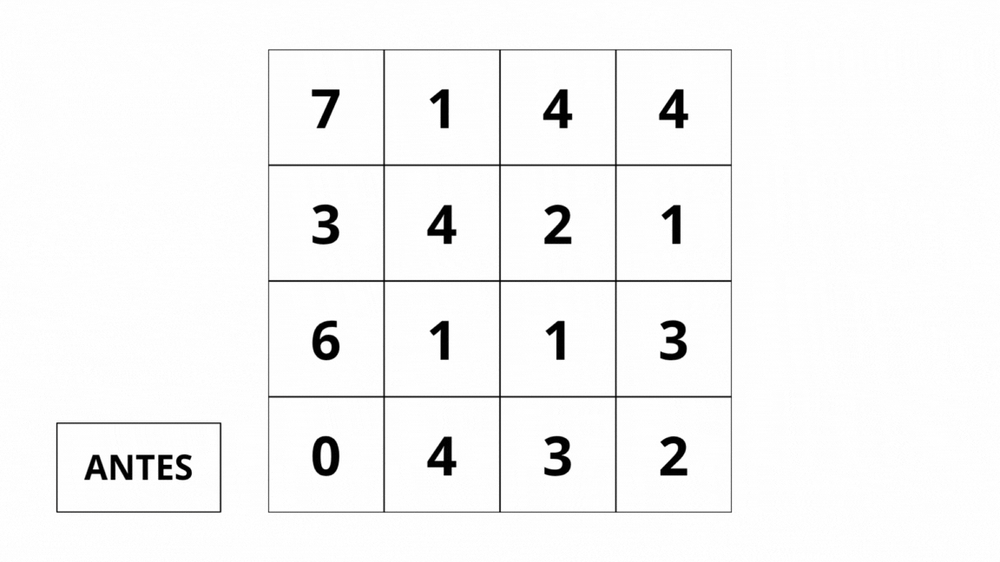

<h1 align="center"> 
 Zoom Digital: Redimensionamento de Imagens com FPGA em Verilog
</h1>

---

## 🧩 Descrição do Projeto

O projeto tem como objetivo criar um **módulo embarcado** para **redimensionar imagens em tempo real**, rodando **inteiramente em FPGA**.  
Ele funciona como um **co-processador gráfico** capaz de fazer **zoom (aproximação)** e **redução** direto no hardware, simulando uma interpolação visual simples.  

Todo o controle é feito pelos **botões da placa**, e a imagem processada aparece em um **monitor VGA**, sem depender de processadores externos — ou seja, o sistema é **totalmente autônomo**.  

---

## ⚙️ Especificações

- **🧠 Linguagem:** Verilog  
- **💻 Kit de desenvolvimento:** DE1-SoC  
- **🎨 Tipo de imagem:** Escala de cinza (8 bits por pixel)  
- **🔧 Operações implementadas:**
  - **Zoom In (Aproximação):**
    - Vizinho Mais Próximo (Nearest Neighbor)
    - Replicação de Pixel (Pixel Replication)
  - **Zoom Out (Redução):**
    - Decimação / Amostragem simples (Nearest Neighbor para Zoom Out)
    - Média de Blocos (Block Averaging)
- **🎛️ Controle:** Botões físicos da FPGA  
- **🖥️ Saída de vídeo:** VGA  
- **🔗 Compatibilidade:** Funciona como **coprocessador** para o processador **ARM (HPS)**  

---

## 🧰 Ambiente de Desenvolvimento

O código foi desenvolvido no **Quartus Prime**, que oferece tudo o que é preciso para criar e testar projetos em FPGA — desde a **edição e compilação** até a **síntese e simulação**.  

Esse ambiente também permite **configurar os pinos**, realizar **testes funcionais e temporais**, e validar o projeto antes da implementação na **placa DE1-SoC**.  

- **🧩 Software utilizado:** Quartus Prime  
- **📦 Versão:** 23.1  
- **🔍 Funcionalidades principais:**
  - Edição e compilação de projetos em Verilog  
  - Síntese para FPGA  
  - Configuração de pinos  
  - Simulação funcional e temporal  
  - Validação do projeto antes da implementação física  

---

## 📦 Guia de Instalação e Uso do Quartus com Projeto do GitHub

### 1. Baixar e instalar o Quartus

1. Acesse o site oficial da Intel FPGA: [https://www.intel.com/content/www/us/en/software/programmable/quartus-prime/download.html](https://www.intel.com/content/www/us/en/software/programmable/quartus-prime/download.html)  
2. Escolha a versão **Quartus Prime Lite 23.1** (Lite é gratuita).  
3. Faça o download do instalador compatível com seu sistema operacional (Windows ou Linux).  
4. Execute o instalador e siga os passos:  
   - Aceite o contrato de licença.  
   - Escolha o caminho de instalação.  
   - Marque os pacotes que deseja instalar (Quartus, ModelSim).  
6. Finalize a instalação e abra o **Quartus Prime**.

### 2. Baixar o projeto do GitHub

1. Acesse o repositório no GitHub.  
2. Clique no botão **Code → Download ZIP**.  
3. Salve o arquivo `.zip` em uma pasta de sua preferência.  
4. Extraia o conteúdo do arquivo `.zip` (clicar com o botão direito → Extrair aqui ou usar um descompactador).

### 3. Abrir o projeto no Quartus

1. Abra o Quartus Prime.  
2. Clique em **File → Open Project…**  
3. Navegue até a pasta descompactada do projeto.  
4. Selecione o arquivo de projeto do Quartus (`.qpf`) e clique em **Open**.  
5. Certifique-se de que todos os arquivos do projeto aparecem na **Project Navigator**.

### 4. Compilar o projeto

1. No Quartus, clique em **Processing → Start Compilation** (ou pressione **Ctrl+L**).  
2. Aguarde a compilação completa.  
3. Verifique se não há erros na **Mensagem de Compilação**.  

### 5. Programar a placa

1. Conecte sua placa DE1-SoC ao computador via cabo USB-Blaster.  
2. No Quartus, abra o **Programmer**: **Tools → Programmer**.  
3. Clique em **Hardware Setup** e selecione o seu **USB-Blaster**.  
4. Clique em **Add File** e selecione o arquivo `.sof` gerado na compilação.  
5. Certifique-se de que a opção **Program/Configure** esteja marcada.  
6. Clique em **Start** para enviar o projeto para a placa.  
7. Aguarde a mensagem de **Success**, indicando que a programação foi concluída.

---

## Kit de desenvolvimento

O Kit de Desenvolvimento **DE1-SoC** apresenta uma plataforma de hardware robusta construída em torno do FPGA Altera System-on-Chip (SoC), que combina os mais recentes núcleos embarcados **Cortex-A9 dual-core** com lógica programável de ponta, oferecendo máxima flexibilidade de projeto. Os usuários podem aproveitar a grande reconfigurabilidade junto a um sistema de processador de alto desempenho e baixo consumo de energia. O SoC da Altera integra um sistema de processador hard baseado em ARM (**HPS**), composto por processador, periféricos e interfaces de memória, ligados de forma transparente à estrutura FPGA por meio de um interconector de alta largura de banda. A placa de desenvolvimento DE1-SoC vem equipada com memória **DDR3** de alta velocidade, recursos de vídeo e áudio, conectividade **Ethernet**, entre outros, oferecendo diversas aplicações potenciais e inovadoras.

--- 

## 🛠 FPGA

- ⚡ **Dispositivo:** Altera Cyclone® V SE 5CSEMA5F31C6N  
- 💾 **Dispositivo de configuração serial:** Altera EPCS128  
- 🔌 **Programação:** USB-Blaster II onboard para programação; Modo JTAG (Também suporta RISC-V JTAG)  
- 🔘 **Botões:** 4 push-buttons  
- ⏱ **Fontes de clock:** Quatro clocks de 50 MHz do gerador de clock  
- 🎨 **VGA:** DAC VGA (DACs triplos de alta velocidade de 8 bits) com conector VGA-out  
- 🔧 **Elementos lógicos programáveis:** 85K  
- 🧠 **Memória embutida:** 4.450 Kbits

---

## Algoritmos

### Aproximação (Zoom in)

A aproximação digital, também conhecida como zoom in, é o processo de ampliação de uma imagem através do aumento do número de pixels. Este processo é fundamental em sistemas de processamento digital de imagens, especialmente em aplicações que requerem análise detalhada de regiões específicas. Os algoritmos de aproximação implementados neste projeto focam na eficiência computacional para execução em hardware FPGA, garantindo processamento em tempo real.

---

### Vizinho Mais Próximo (Nearest Neighbor Interpolation)

A **Interpolação por Vizinho Mais Próximo** é o método mais simples e fundamental de ampliação de imagens digitais . Esta técnica é amplamente utilizada em sistemas embarcados devido à sua **simplicidade computacional** e **velocidade de processamento**.

---

#### ⚙️ Como Funciona

1.  **Princípio Básico:**
    Para cada novo pixel na imagem ampliada, o algoritmo determina qual pixel da imagem original está mais próximo geometricamente.

2.  **Processo Passo a Passo:**
    * Calcula-se a posição correspondente na imagem original para cada pixel da nova imagem 
    * Encontra-se o pixel mais próximo através do **arredondamento das coordenadas**
    * O valor de intensidade do pixel mais próximo é **copiado diretamente**

3.  **Cálculo das Coordenadas:**

    Para uma ampliação com fator de zoom **n**, as coordenadas são mapeadas por:

$$x_{original} = \frac{x_{novo}}{n}, \quad y_{original} = \frac{y_{novo}}{n}$$

#### 📌 Exemplo Prático

Se uma imagem tem 100x100 pixels e aplica-se um **fator de zoom** n = 2, a nova imagem terá:

👉 200x200 pixels.

#### 🔬 Exemplo Visual

A imagem acima ilustra a aplicação do algoritmo de vizinho mais próximo. O fator de zoom está indicado no canto superior esquerdo da imagem. Cada pixel da região superior esquerda é duplicado de acordo com o fator de zoom, formando uma imagem ampliada, onde cada novo pixel assume o valor do pixel mais próximo da imagem original.

Para um pixel na posição (150, 120) da imagem ampliada:
- Coordenada original: (75.0, 60.0)
- Vizinho mais próximo: (75, 60)
- Valor copiado: intensidade do pixel (75, 60)

#### 🔬 Características do Algoritmo

| Aspecto | Detalhe |
| :---: | :--- |
| **⚡ Velocidade** | **Extremamente rápido:** Apenas operações de divisão e arredondamento |
| **💾 Memória** | **Baixo consumo:** Não requer armazenamento de valores intermediários |
| **🎯 Precisão** | **Preserva valores originais:** Nenhum pixel artificial é criado |

---

#### 🎯 Vantagens e Desvantagens

| Categoria | Detalhe |
| :---: | :--- |
| **🟢 Vantagem** | **Simplicidade Extrema:** Implementação direta, ideal para FPGA e sistemas de tempo real. Preserva perfeitamente os valores de pixel originais. |
| **🟢 Vantagem** | **Eficiência:** Requer apenas operações básicas de aritmética inteira, sem multiplicações complexas ou cálculos de média. |
| **🔴 Desvantagem** | **Efeito Escada:** Produz bordas serrilhadas (*aliasing*) em linhas diagonais e curvas devido ao arredondamento discreto. |
| **🔴 Desvantagem** | **Perda de Suavidade:** A imagem resultante pode parecer pixelizada, especialmente em ampliações grandes. |

#### 🧩 Aplicações Ideais

**Perfeito para:**
- Sistemas embarcados com recursos limitados.
- Processamento de imagens em tempo real.
- Ampliação de *pixel art* e gráficos de jogos retrô.
- Aplicações onde a **velocidade** é mais importante que a **qualidade visual**.

---

### 🖼️ Replicação de Pixel (Pixel Replication)

A **Replicação de Pixel**, também conhecida como **Pixel Replication**, é uma das técnicas mais simples e clássicas de ampliação de imagens digitais. Apesar da sua simplicidade, é muito utilizada em contextos onde a **velocidade** é mais importante do que a **qualidade visual**.

#### ⚙️ Como Funciona

1.  **Princípio Básico:**
    O objetivo é aumentar o número total de *pixels* (ou *amostras*) da imagem original.

2.  **Processo Passo a Passo:**
    * Cada *pixel* da imagem original é **replicado** (copiado) várias vezes.
    * O número de cópias depende do **fator de zoom** (n)
    * O pixel mantém exatamente a **mesma cor** e **valor de intensidade**.

3.  **Cálculo do Novo Tamanho:**

    A nova dimensão é dada por:

$$\text{Nova Dimensão} = (\text{Linhas Originais} \times n, \ \text{Colunas Originais} \times n)$$

#### 📌 Exemplo Prático

Se uma imagem tem 100x100 pixels e aplica-se um **fator de zoom** n = 3, a nova imagem terá:

👉 300x300 pixels.

#### 🔬 Exemplo Visual

A imagem acima ilustra a aplicação do algoritmo de replicação de pixels. O fator de zoom está indicado no canto superior esquerdo da imagem. Cada pixel do bloco 2x2 superior esquerdo é replicado para formar um novo bloco 2x2, resultando em uma imagem do mesmo tamanho da original, porém com o zoom aplicado.

#### 🎯 Vantagens e Desvantagens

| Categoria | Detalhe |
| :---: | :--- |
| **🟢 Vantagem** | **Extrema Simplicidade:** Implementação direta, sem cálculos complexos nem interpolação. Ideal para aplicações em tempo real ou dispositivos com baixo poder de processamento. |
| **🔴 Desvantagem** | **Perda de Qualidade:** A imagem resultante apresenta um aspeto **pixelizado** e **borrado** (*blurry*), especialmente visível em imagens fotográficas. |
| **🧩 Melhor Uso** | Muito usada em jogos retrô, *pixel art*, ou visualizações rápidas onde o estilo "quadrado" é desejado. |

---

### Redução (Zoom Out)

A redução digital, também conhecida como zoom out, é o processo de diminuição do tamanho de uma imagem por meio da redução do número de pixels exibidos. Esse procedimento tem como principal objetivo representar a mesma informação visual de forma mais compacta, mantendo a coerência estrutural da imagem original.

---

### 🟥 Decimação / Amostragem (Nearest Neighbor for Zoom Out)

O **algoritmo de Decimação** é uma técnica simples de **redução de imagens**, utilizada quando o objetivo é diminuir o tamanho da imagem de forma rápida, mesmo que isso implique em perda de detalhes. É eficiente para contextos onde a **velocidade** é mais importante do que a **precisão visual**.

#### ⚙️ Como Funciona

1.  **Princípio Básico:**
    Reduzir a imagem selecionando apenas alguns pixels representativos e descartando os demais.

2.  **Processo Passo a Passo:**
    * Divida a imagem em blocos de tamanho `2x2`.  
    * Para cada bloco, selecione **apenas o pixel superior esquerdo**.  
    * Alocar esse pixel no centro do bloco correspondente na nova imagem.  
    * Descartar os outros 3 pixels.  

3.  **Cálculo do Novo Tamanho:**

    A nova dimensão é dada por:

$$\text{Nova Dimensão} = \frac{\text{Linhas Originais}}{2}, \ \frac{\text{Colunas Originais}}{2}$$

#### 📌 Exemplo Prático

Se uma imagem tem 100x100 pixels e aplica-se a decimação com blocos de `2x2`, a nova imagem terá:

👉 50x50 pixels.

#### 🔬 Exemplo Visual

A imagem acima ilustra a aplicação do algoritmo de decimação. A cada bloco de 2x2 pixels, o pixel superior esquerdo é selecionado e alocado no centro do bloco correspondente na nova imagem, enquanto os outros três pixels são descartados. Esse processo é repetido para todos os blocos, resultando em uma versão reduzida da imagem original.

#### 🎯 Vantagens e Desvantagens

| Categoria | Detalhe |
| :---: | :--- |
| **🟢 Vantagem** | **Simplicidade e Velocidade:** Implementação direta, ideal para redução rápida de imagens e processamento em tempo real. |
| **🔴 Desvantagem** | **Perda de Detalhes:** Muitos pixels são descartados, podendo resultar em imagens borradas ou com informações ausentes. |
| **🧩 Melhor Uso** | Redução rápida de imagens, pré-processamento para compressão ou aplicações onde tamanho e velocidade são mais importantes que fidelidade visual. |

---

### 🟦 Média de Blocos (Block Averaging / Downsampling with Averaging)

A **Média de Blocos** é uma técnica de redução de imagens digitais que visa diminuir o tamanho da imagem de forma uniforme, calculando a média dos pixels em blocos. É um método simples e eficaz para criar uma versão menor da imagem mantendo a suavidade visual.

#### ⚙️ **Como Funciona**  
**Princípio Básico:** Cada bloco de n pixels da imagem original é substituído por um único valor que representa a média de intensidade ou cor de todos os pixels do bloco.

**Processo Passo a Passo:**

1. Divida a imagem em blocos de tamanho `n x n`.  
2. Para cada bloco, calcule a média de todos os pixels (valores de cor ou intensidade).  
3. Substitua um determinado pixel pelo valor médio.  
4. Repita o processo para todos os blocos da imagem, formando a imagem reduzida.

**Cálculo do Novo Tamanho:**  

- A nova dimensão é dada por:  

\[
\text{Nova Dimensão} = \frac{\text{Linhas Originais}}{n} , \frac{\text{Colunas Originais}}{n}
\]

#### 📌 **Exemplo Prático**  
Se uma imagem tem 100x100 pixels e se aplica blocos de `2x2` para redução:  

👉 A nova imagem terá 50x50 pixels.

#### 🔬 Exemplo Visual

A imagem acima ilustra a aplicação do algoritmo de Média de Blocos. A cada bloco de 2x2 pixels, é calculada a média dos valores de intensidade ou cor, e esse valor é alocado no centro do bloco correspondente na nova imagem reduzida. Esse processo é repetido para todos os blocos, resultando em uma versão menor da imagem original, mantendo a suavidade visual.

#### 🎯 **Vantagens e Desvantagens**  

| Categoria | Detalhe |
|-----------|---------|
| 🟢 **Vantagem** | Redução eficiente de tamanho mantendo suavidade; menos ruído. |
| 🔴 **Desvantagem** | Perda de detalhes finos; bordas podem ficar borradas. |
| 🧩 **Melhor Uso** | Ideal para redução de imagens, pré-processamento para compressão ou visualizações rápidas. |

---

## Caminho de Dados

🔗 [Ver em alta qualidade](https://viewer.diagrams.net/?tags=%7B%7D&lightbox=1&target=blank&highlight=000000&layers=1&nav=1&title=Caminho%20de%20Dados.drawio&dark=auto#Uhttps%3A%2F%2Fdrive.google.com%2Fuc%3Fid%3D16_pdd4TADHBSyZAoE4eO0e6Gq3GJ_Lt0%26export%3Ddownload)

## 🧠 Arquitetura do Sistema de Processamento de Imagens FPGA

Este projeto implementa uma arquitetura completa para **processamento digital de imagens em FPGA**, com suporte a múltiplos algoritmos e exibição em **VGA**.  
A coordenação geral é feita pelo módulo `control_unit`, que gerencia os sinais de controle, endereços e dados entre os módulos e as memórias.

---

### 🔷 Visão Geral

O sistema permite a execução dos seguintes algoritmos de forma independente:

- 🔁 **Pixel Replication** – Zoom in por duplicação de pixels.  
- 🔻 **Pixel Decimation** – Redução de resolução (zoom out).  
- ⚖️ **Block Averaging** – Suavização por média de blocos 2×2.  
- 🔲 **Nearest Neighbor Interpolation** – Interpolação por vizinho mais próximo.

Cada operação é iniciada por um sinal de **start** específico e processada com base nos dados da memória primária.

---

## 🧩 Estrutura do Sistema

### 🕹️ CONTROL – Unidade de Controle Principal

- Gerencia todos os módulos de processamento.  
- Recebe os sinais `START_REPL`, `START_DEC`, `START_AVG` e `START_NN`.  
- Garante que apenas **um algoritmo** seja executado por vez, evitando conflitos entre módulos.  
- Controla o fluxo de dados entre a **memória primária**, a **memória secundária** e o módulo **VGA**, coordenando as leituras e escritas durante o processamento.  
- Define o **modo de exibição**:  
  - `320x240` → imagem original ou ampliada (zoom in)  
  - `160x120` → imagem reduzida (zoom out)  
- Também é responsável por **sincronizar a atualização da imagem na saída VGA** conforme o algoritmo selecionado.

### 🎛️ Controle por Botões Físicos (KEYs)

O acionamento dos algoritmos é feito por meio dos **botões físicos (KEYs)** presentes na placa DE1-SoC. Cada botão inicia a execução de um módulo de processamento específico:

| Botão | Função | Algoritmo Ativado |
| :---: | :---: | :--- |
| **KEY0** | 🔁 | **Replicação de Pixel (Pixel Replication)** |
| **KEY1** | 🔲 | **Vizinho Mais Próximo (Nearest Neighbor)** |
| **KEY2** | 🔻 | **Decimação (Pixel Decimation)** |
| **KEY3** | ⚖️ | **Média de Blocos (Block Averaging)** |

Ao pressionar um dos botões, o sistema envia o sinal correspondente de `START`, ativando o módulo de processamento apropriado.  
Quando um novo algoritmo é selecionado, o sistema **restaura automaticamente a imagem original** antes de aplicar o próximo processamento, garantindo que cada resultado seja independente e livre de interferências de execuções anteriores.

---

### ⚙️ Módulos de Processamento

#### 🔁 Pixel Replication
- Duplica cada pixel para gerar uma imagem ampliada.  
- Cria novos endereços de escrita e dados replicados.  
- Utilizado para **zoom in**.

#### 🔻 Pixel Decimation
- Reduz a resolução da imagem descartando pixels em intervalos regulares.  
- Ideal para **zoom out**.

#### ⚖️ Block Averaging
- Calcula a média de blocos 2×2 de pixels.  
- Reduz ruídos e suaviza transições.  
- Usa dois módulos auxiliares:  
  - `address_counter_avg`: gera endereços de leitura.  
  - `block_average`: calcula a média de quatro valores.

#### 🔲 Nearest Neighbor Interpolation
- Redimensiona a imagem utilizando o método do **vizinho mais próximo**.  
- Mantém bordas nítidas e processamento rápido.

---

### 📦 COPY COUNTER

- Responsável pela **cópia inicial** da imagem da memória primária para a secundária.  
- Também restaura a imagem base antes de aplicar um novo algoritmo.

---

### 🔀 MUX – Multiplexadores

- Selecionam quais sinais (endereços, dados e enable de escrita) são enviados à **memória secundária**.  
- Alteram dinamicamente conforme o algoritmo ativo.

---

### 💾 Memórias

#### 📘 Primary Memory
- Armazena a **imagem original**.  
- Somente leitura durante o processamento.

#### 📙 Secondary Memory
- Armazena o **resultado processado**.  
- É constantemente sobrescrita pelos módulos ativos.

---

### 🖥️ Sistema VGA

#### 🎛️ VGA Controller
- Lê os pixels da **memória secundária**.  
- Gera sinais de cor (`R`, `G`, `B`) e endereços de leitura.  
- Suporta os modos 320×240 e 160×120.

#### 💡 VGA Output / Driver
- Converte os sinais em formato compatível com monitores VGA.  
- Gera `hsync`, `vsync`, `blank`, `sync` e `clk`.

---

### 🔄 Fluxo de Dados

1. O controle inicia a cópia da imagem base.  
2. Um algoritmo é ativado por um sinal de start.  
3. O módulo correspondente lê da **memória primária** e escreve na **memória secundária**.  
4. O controlador VGA exibe o resultado em tempo real.  
5. Se outro algoritmo for selecionado, o sistema restaura a imagem original antes de aplicar o novo processamento.

---

## 🧪 Testes e Resultados

### 🔁 Imagem original

---

### 🔁 Aplicação do algoritmo Pixel Replication

---

### 🔻 Aplicação do algoritmo Pixel Decimation

---

### ⚖️ Aplicação do algoritmo Block Averaging

---

### 🔲 Aplicação do algoritmo Nearest Neighbor Interpolation

---

## ✅ Conclusão

O projeto de **Zoom Digital em FPGA** demonstrou com sucesso a implementação de algoritmos de **ampliação e redução de imagens** em tempo real, totalmente executados no hardware da placa DE1-SoC. A partir dos testes realizados, foi possível observar que:

- O **Pixel Replication** proporciona uma ampliação rápida, preservando os valores originais, porém com efeito pixelizado perceptível.  
- O **Nearest Neighbor** mantém bordas nítidas e é eficiente em termos de processamento, sendo ideal para aplicações que priorizam velocidade.  
- A **Decimação** permite redução eficiente do tamanho da imagem, mas implica em perda de detalhes finos.  
- A **Média de Blocos** reduz ruídos e suaviza transições, gerando imagens menores com melhor aparência visual, embora com ligeira perda de nitidez.

O sistema desenvolvido mostrou-se **robusto e autônomo**, utilizando apenas a FPGA e a memória da placa, sem depender de processadores externos. Os resultados confirmam que cada algoritmo possui características específicas de desempenho e qualidade visual, permitindo selecionar o método mais adequado conforme a aplicação desejada.

Em suma, o projeto valida a **viabilidade do processamento de imagens em tempo real em FPGA**, combinando eficiência, flexibilidade e autonomia, servindo como uma base sólida para futuras aplicações em sistemas embarcados e processamento gráfico direto no hardware.

---

## 🖥️ Contribuidores

           

---

## 📚 Referências

**Digital Image Processing - Zooming Methods** - Tutorialspoint. Disponível em: <a href="https://www.tutorialspoint.com/dip/zooming_methods.htm" target="_blank">https://www.tutorialspoint.com/dip/zooming_methods.htm</a>

**Digital image processing** - Wikipedia. Disponível em: <a href="https://en.wikipedia.org/wiki/Digital_image_processing" target="_blank">https://en.wikipedia.org/wiki/Digital_image_processing</a>

**Interpolação por vizinho mais próximo** - Wikipedia. Disponível em: <a href="https://pt.wikipedia.org/wiki/Interpolação_por_vizinho_mais_próximo" target="_blank">https://pt.wikipedia.org/wiki/Interpolação_por_vizinho_mais_próximo</a>

**Wojcicki, K.** (2020). *Nearest Neighbour Interpolation Theory*. Disponível em: <a href="https://kwojcicki.github.io/blog/NEAREST-NEIGHBOUR" target="_blank">https://kwojcicki.github.io/blog/NEAREST-NEIGHBOUR</a>

**Digital Image Processing - Zooming Methods** - Tutorialspoint. Disponível em: <a href="https://www.tutorialspoint.com/dip/zooming_methods.htm" target="_blank">https://www.tutorialspoint.com/dip/zooming_methods.htm</a>

**Nearest-neighbor interpolation** - Wikipedia. Disponível em: <a href="https://en.wikipedia.org/wiki/Nearest-neighbor_interpolation" target="_blank">https://en.wikipedia.org/wiki/Nearest-neighbor_interpolation</a>

**Centeno, M.** *Processamento digital de imagens - Interpolação*. UFPR. Disponível em: <a href="https://docs.ufpr.br/~centeno/m_pdi/pdf/jaulapdi05.pdf" target="_blank">https://docs.ufpr.br/~centeno/m_pdi/pdf/jaulapdi05.pdf</a>

**Nearest Neighbour Interpolation - Image Processing** - Giassa. Disponível em: <a href="https://www.giassa.net/?page_id=207" target="_blank">https://www.giassa.net/?page_id=207</a>

* **Conceitos de Zooming e Reamostragem:** [Tutorialspoint - Zooming Methods](https://www.tutorialspoint.com/dip/zooming_methods.htm)
